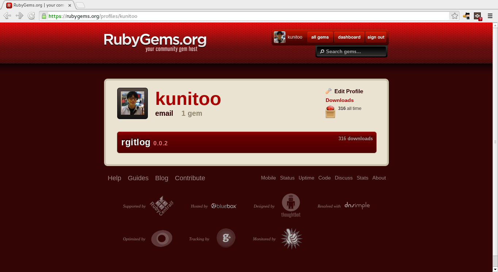
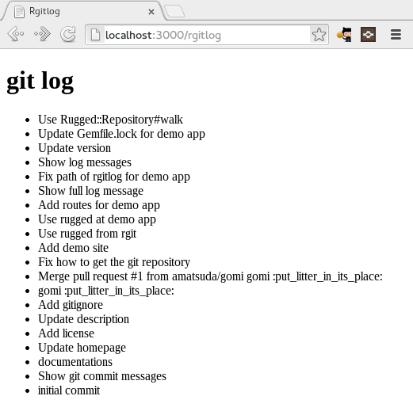

# 大江戸Ruby会議04

subtitle
:  1年かけて1つのgemを作りました

author
:  伊藤 邦彦

presentation-date
:  2014/04/19

institution
:  永和システムマネジメント

allotted-time
:  20m

# はじめに

発表する機会をいただき
ありがとうございます

# 自己紹介

* Kunihiko Ito
* @kunitoo
* Asakusa.rb歴: 約1年半
* rgitlog を作ってます

# 今日話すこと

* Asakusa.rb でやっていること
* 作ったgemのこと

# Asakusa.rb でやっていること

* 上野会場のドアを開けたり
* 他の人の話を聞いたり
* 写経したり
* gem を作ったり

# 上野で会場のドアを開けたり

ドア番をお願いされたのが Meet up に参加するきっかけ

# 他の人の話を聞いたり

* 会話の単語が分からない
* 調べながら会話を聞く
* 少しずつ慣れて話が分かるようになった

# 写経したり

* Rails Tutorial
* Rails Guides
* RubyGems Guides

# gem を作ったり

* 自己紹介するときに話せる代表作がほしい
* なにを作るか考えるところから始めた

# 作ったgem

# rgitlog

* rails アプリの git log をブラウザで見ることができます

# Insatall

以下を変更するだけ

* Gemfile
* config/routes.rb

# Gemfile

    gem 'rgitlog'

次に

    % bundle

# config/routes.rb

    mount Rgitlog::Engine, at: '/rgitlog'

# Usage

# rgitlogができるまで

* やりたいこと探し
* gitを扱うライブラリ探し

# rgitlogができるまで

* *やりたいこと探し*
* gitを扱うライブラリ探し

# やりたいこと

* 開発中に以前のバージョンの見た目が気になることがあった
* 動作確認中はブラウザだけで完結したい
* git checkout したくない

# これからやりたいこと

* ブランチを選択して checkout したい
* diff を見れるようにしたい
* 見た目をかっこよくしたい

# rgitlogができるまで

* やりたいこと探し
* *gitを扱うライブラリ探し*

# 最初のバージョン

- mojombo/grit
- mojombo/grit はRuby 2.0で動かなかった
- gitlabhq/grit フォークを使用

# grit での git log 取得

    Repo.new('path/to/my/repository').commits

# watchしていたらある日

*"Grit is no longer maintained. Check out rugged"*

Pull Request が 118 close された

# rugged での git log 取得

    Rugged::Repository.new('path/to/my/repository').head.log

# rugged での git log 取得

    Rugged::Repository.new('path/to/my/repository').head.log

*reflog 取得されます*

# 正解

    repo = Rugged::Repository.new('path/to/my/repository')
    repo.walk(repo.last_commit)

気付くのに数ヶ月かかりました orz

# rgitlog リリースまで

* 作りたいと思ってから約1年
* 実はとっても簡単に作れます

# rgitlogの作り方

*今から作ります!*

時間ありますよね?

# rails plugin new

    $ rails plugin new rgitlog --mountable -O -B
    $ cd rgitlog
    $ bundle --local

# Add rugged

rgitlog.gemspec

    s.add_dependency "rugged"

# generate controller

    $ rails g controller rgitlog index

# Controller

    require_dependency "rgitlog/application_controller"
    require 'rugged'

    module Rgitlog
      class RgitlogController < ApplicationController
        def index
          path = Rugged::Repository.discover(Dir.pwd)
          repo = Rugged::Repository.new(path)
          @commits = repo.walk(repo.last_commit).to_a
        end
      end
    end

# View

    <h1>commits</h1>
    <ul>
      <% @commits.each do |commit| %>
        <li><%= commit.message %></li>
      <% end %>
    </ul>

# Routes

    root to: 'rgitlog#index'

# 完成

慣れると10分くらいで作れるようになる

# まとめ

Asakusa.rbに通いこつこつと続けていれば、
1年かかったことが20分でできるようになります
